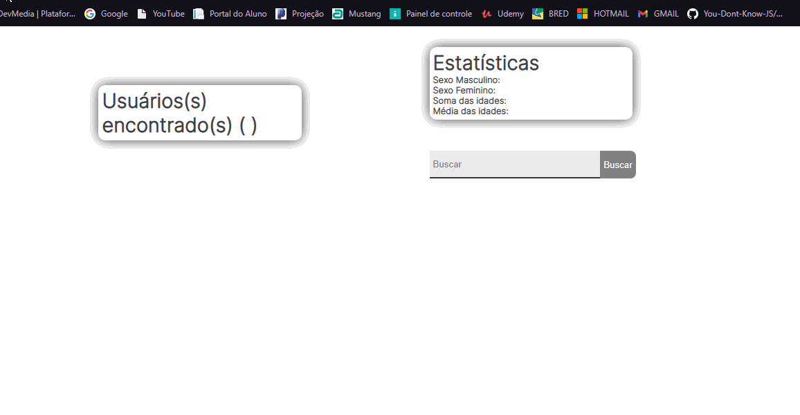

<h1 align="center">
  
</h1>

  <a href="#-tecnologias">Tecnologias</a>&nbsp;&nbsp;&nbsp;|&nbsp;&nbsp;&nbsp;
  <a href="#-projeto">Projeto</a>&nbsp;&nbsp;&nbsp;|&nbsp;&nbsp;&nbsp;
  <a href="#-Objetivo">Objetivo</a>&nbsp;&nbsp;&nbsp;|&nbsp;&nbsp;&nbsp;
  <a href="#-how-to-test">How to test?</a>&nbsp;&nbsp;&nbsp;|&nbsp;&nbsp;&nbsp;

 

  

## 🚀 Tecnologias

Esse projeto foi desenvolvido com as seguintes tecnologias:

- HTML
- CSS
- JavaScript

## 💻 Projeto

O projeto criar uma aplicação para filtrar usuários e mostrar estatísticas a partir do filtro definido, utilizando um backend pré-definido.

## 🔖 Objetivo

Esse projeto foi realizado com o objetivo de colocar em prática o que aprendi no Modulo 1 - Fundamentos - Desenvolvedor(a) Full Stack, do Bootcamp Dev Fullstack do IGTI- Instituto de Gestão e Tecnologia da Informação.

## 💻 How to test?

Para testar esse projeto você terá que "Subir" o backend de usuários, basta executar "yarn" ou "npm install" para instalar
as dependências e executar "yarn start" ou "npm start" para deixar o backend online. Este backend está configurado para "escutar" a porta 3001.

<h3><strong>Feito por Bryan.</strong><h3>

